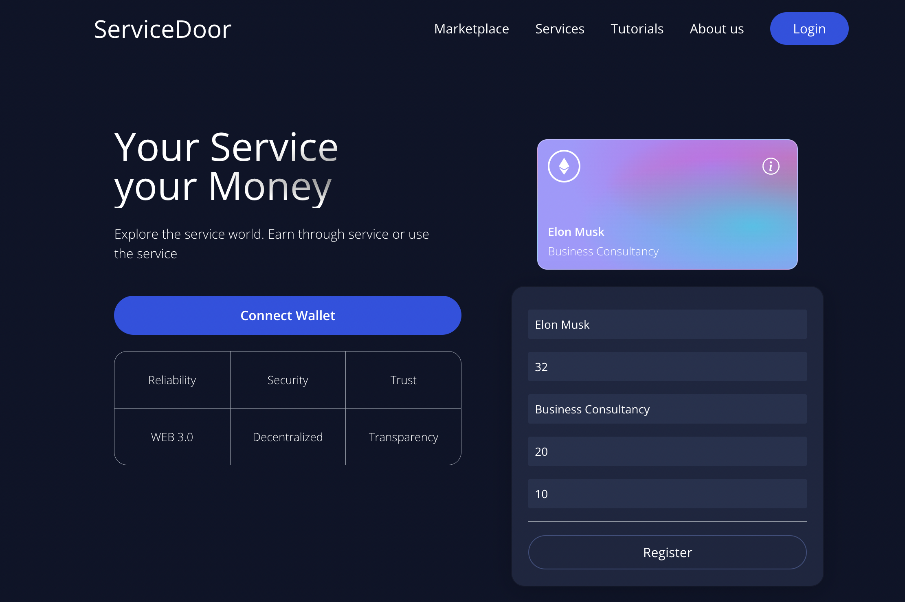
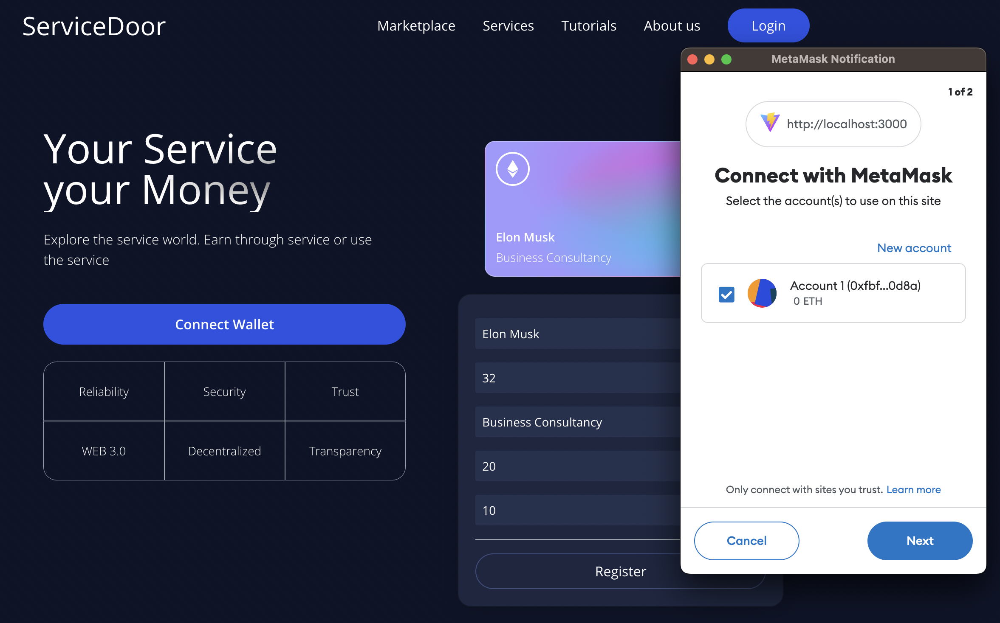

# Service Door - A blockchain application

An open source blockchain project, it is an marketplace of services. An attempt to decentralized the idenity management and transactions in the marketplace
environment. With the help of etherium blockhain, ERC-20 tokens and smart contracts this project currently has the capability to create an account with
Metamask, post a service on the network, send and receive tokens i.e. transactions.

Read the Project Details document for more information.

## Technologies used:

1. Ethereum
2. Solidity
3. React
4. Hardhat
5. Alchemy
6. Tailwind

## Steps to run

1. Clone the repository
2. cd client && npm run dev
3. If you modify the smart contract make sure you deploy it on alchemy.
4. Visit the port of the application.
5. Make sure you install Metamask browser extenstion.
6. Login with Metamask
   
7. Add a test network
8. Use the application

## Usage

1. To use the application you should have minimum 10 ETH in your account.
2. To register your service fill the form shown on the home page.
3. Your registered service will be visible below in the 'Latest Services' section.
4. Create another account on the same network and you will be able to see your service listed.
5. Buy a service and pay for the required amount by Metamask wallet.
